# Osprey Store

Osprey Store is web store platform providing marketplace for the sellers and the customers.  It was created with a purpose to became familiar and implement software with some fancy frameworks and patterns. Inspired by <a href="https://github.com/dotnet-architecture/eShopOnWeb">Microsoft reference solution</a>.
Please note that it was desined to look good on any screen.
I hope you can find some useful pieces of code there.

Frameworks and tools used
---
- ASP.NET Core 2.1
- Angular 7
- Bootstrap 4

Installing
---
Need to specify files folder in appsettings.json, c:\files by default.
Just clone and run server, no special actions required.

General database structure
---
Item (say iPhone XR) is what supposed to be sold in the Store (John's store) and it belongs to a certain Category (Smartphones). But there are also different Item Variants of this item (say 128GB white color). 
Each Item Variant stores association (ItemProperty) of Characteristics (say Color, Storage) and Characteristic Values (White and 128GB in this case). There maybe many Item Variant Images of one Item Variant. Characteristic also belong to a certain Category. Adding Item Variant into a cart creates a Cart Item, and then Order could be created from that.

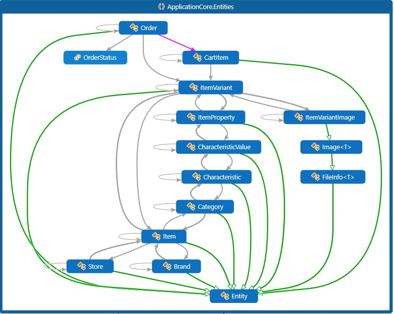

Core patterns, principles and features
---
- SOLID principles
- Testability
- Specification pattern
- RESTful web services
- Database consistency checks
- JSON Web tokens authentication
- ASP NET Core authorization
- Bootstrap flexbox adaptive layout

### SOLID

#### S—Single responsibility principle
Each component designed for one thing and has minimal knowledge of outside components and their logic. For example, each service is responsible for lifecycle of it's entity, and supposed to be changed if and only if this lifecycle changes. Although one component may depend on the other one, implementation details are hidden behind it's abstractions.

#### O—Open/closed principle
Services and controllers created with maximum code reusing possibily in mind. Base classes describe common processes, while child classes are free to extend and reuse it if needed. 
For example, generally the process of creating an entity is similar between different services.

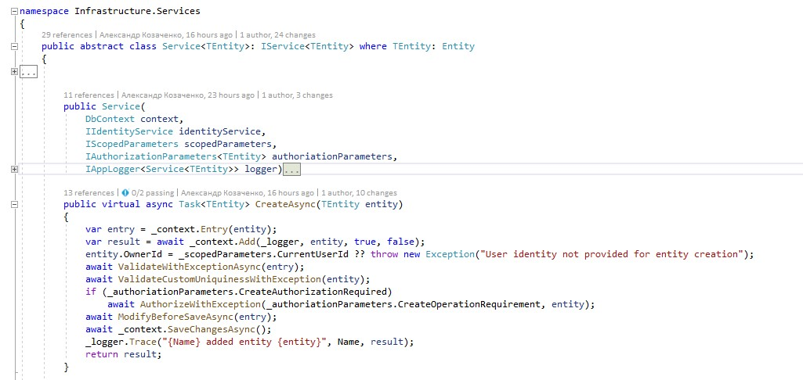

When we need to add file to storage while creating an entity (ItemVariantImageService), this general process could be easily extended while still keeping and reusing the original logic

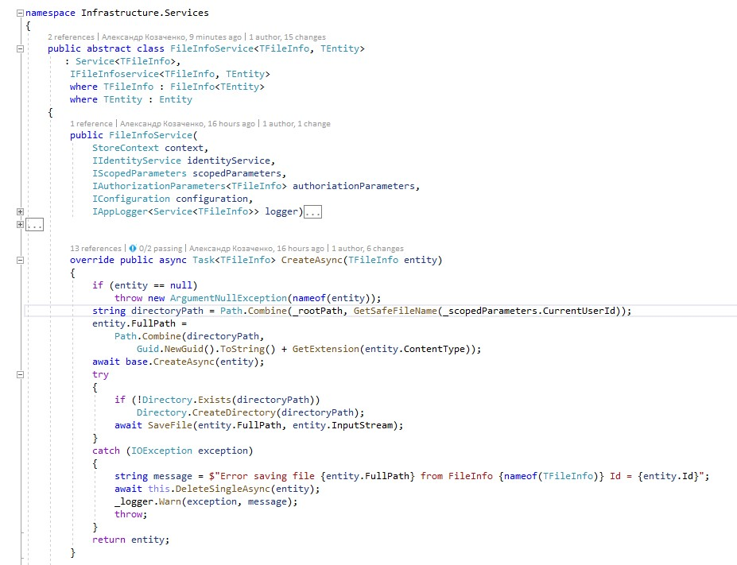

#### L-Liskov substitution principle
Controllers rely on services to create/read/update/delete entities. Although the internal logic may differ greatly from service to service, in the end it's just generic controller calling generic service while passing some arguments.

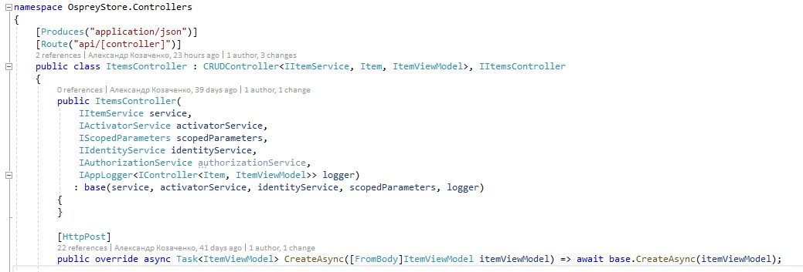
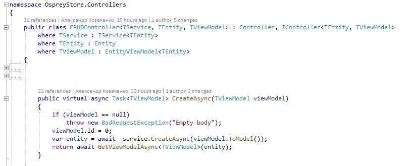

#### I-Interface segregation principle
As already mentioned, service may rely on other services, but only does so through interfaces. In this example, ItemService requires ICategoryService to filter by category and IItemVariantImageService to maintain database consistency.

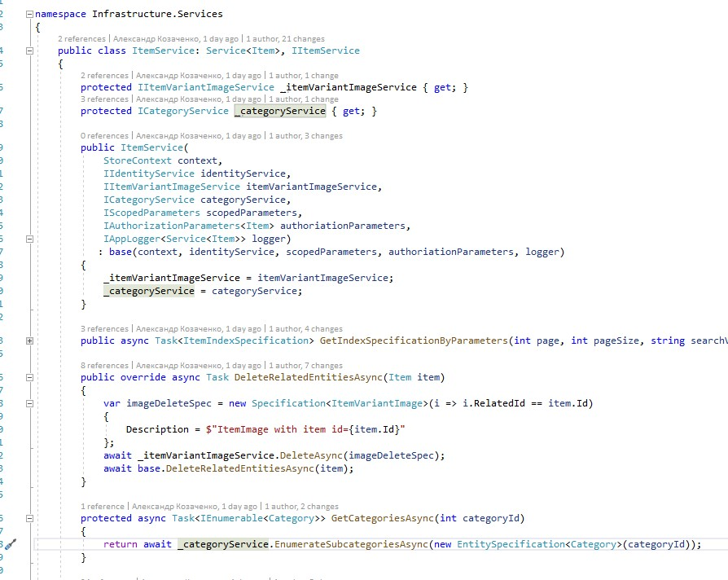

#### D-Dependency inversion principle
Accrording to Clean Architecture principles, the most important one is the dependancy inversion principle which is the pillar of the clean architecture.
While there are still some references from OspreyStore to Infrastructure, it's only limited to database seeding and DI setup, as it's shown on a graph below (because eliminating this project refrenece completely seemed rather complex and verbose by means of standard NET Core DI).

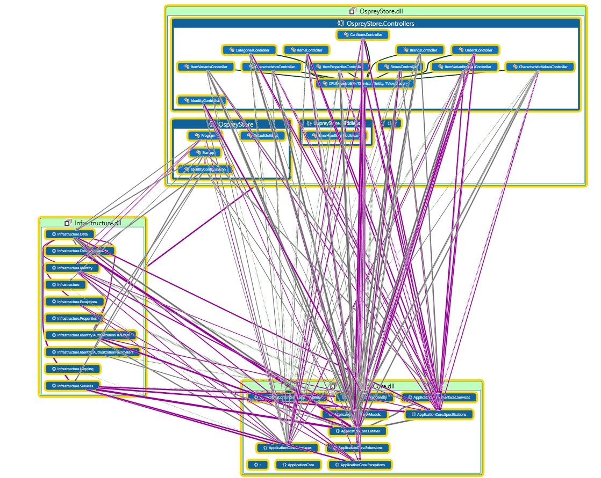

### Testability
Creating testable code following aforementioned principles is rather easy. Tests also reuse code from base classes extensively, only overriding what exacly should be tested, and by which criteria, which in turn allows to create new tests in no time.

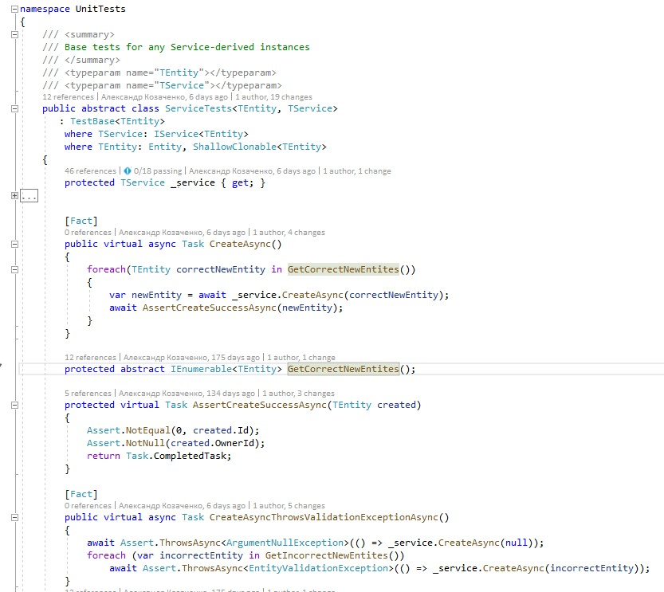

### Specification pattern
Avoing code duplication, keeping interface definitions rather simple in a clean and concise way only possible thanks to EF Core flexibility.
Complex conditions and nested joins are parts of separate classes with strict type checks, not retrieval logic, which allows to reuse code as much as possible.
Below displayed specification for filtering items by many conditions, depending on which were provided in constructor.

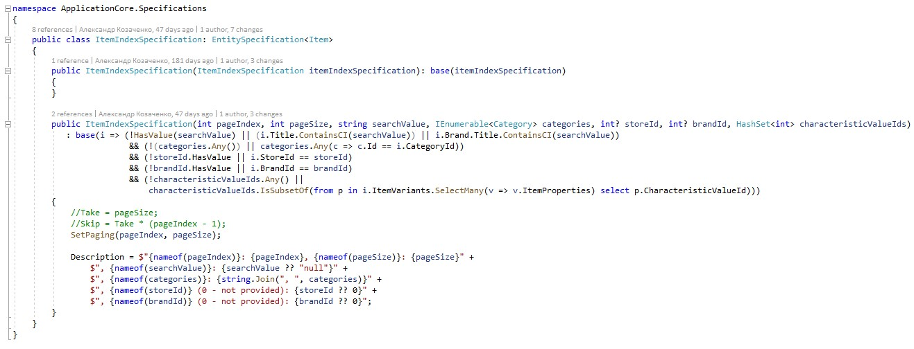

### RESTful web services
Each entity has a separate controller with methods whose URIs conform to the definition of RESTful JSON API. URI names are consistent across different controllers.

| Command | URI pattern |
| --- | --- |
| Get single entity |  GET api/[controller]/{id:int} |
| Get single entity with detailed information to avoid redundant requests | GET api/[controller]/{id:int}/detail |
| Create entity | POST api/controller/ |
| Index entities | GET api/controller/ |
| Index entities thumbnails | GET api/controller/thumbnails |
| Check if current user is authorized to update entity | GET {id:int}/checkUpdateAuthorization |
| Delete single entity| DELETE api/[controller]/{id:int} |
| Update single entity| PUT api/[controller]/{id:int} |
| Index all images of item variant | GET /api/itemVariants/{itemVariantId:int}/images |
| Post Item variant image | POST /api/itemVariants/{relatedId:int}/image |

### JSON Web tokens authentication
The authentification process leverages updatable JSON Web Tokens. On the client side IdentityService is responsible for seamless token update, in such a way that other services could send and receive requests withou any authentication hassle.
For demonstrational purposes token lifetime set to 10 seconds: client application works normaly and updates tokens on it's own. Username and password only send on the first login and if update token expires.

### Database consistency checks
Each create and update operation requires validation of entity parameters which is specific for each entity. In some cases it means forbidding any property update to ensure database consistency, in other ones ensuring that new values of updatable properties make sense and correct.
For example, Item property ItemVariantId and CharacteristicValueId are only allowed to be set on creating and not updatable. It's verified that ItemVariantId is correct, and that CharacteristicValueId is set in such a way that it exists an it belongs to the same category as the Item.

### ASP NET Core authorization
ASP NET Core Authorization Handlers for each entity ensure that the current user is allowed to perform the operation requested.
Authorization handlers called by respective services when performing any CRUD operation. Generally they ensure that only the store owner is able to change entities that dependend on his store (items, item variants, images, orders and etc).
Authorization system is designed in a testable way (althogh no such tests implemented in my project). Also for each entity IAuthorizationParameters implementation could be redefined to disable unnecessary default authentication checks, or enable even stricter ones.
For example, Order entity requires read permission, because such information is only for a customer and a seller.

### Bootstrap flexbox adaptive layout
Angular client application leverages Bootstrap Flexbox Grid capabilities to ensure that a website is rendered correctly on any device.
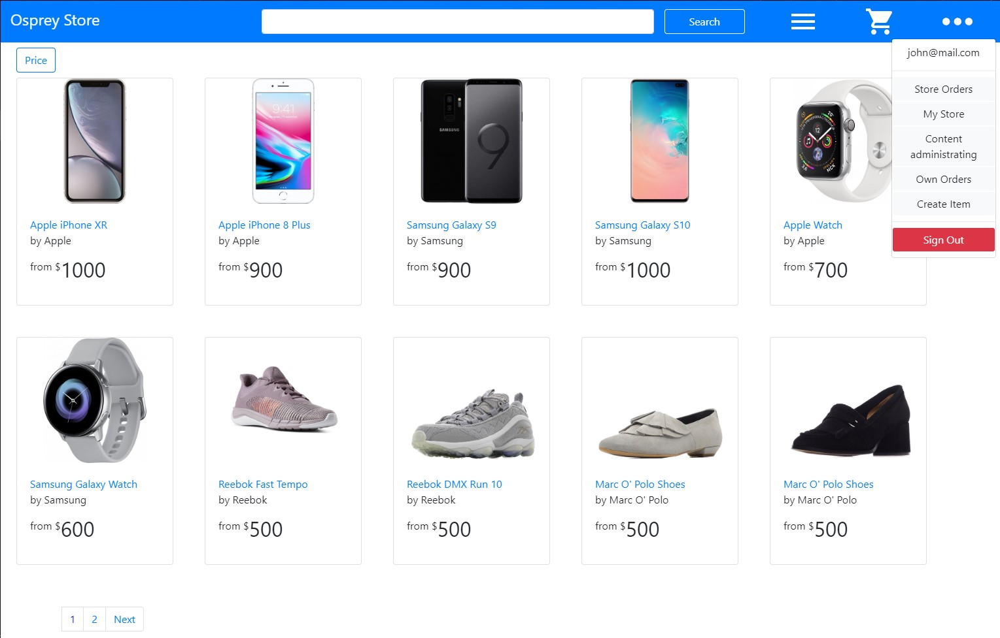

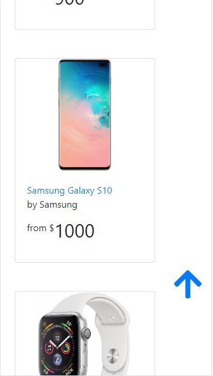
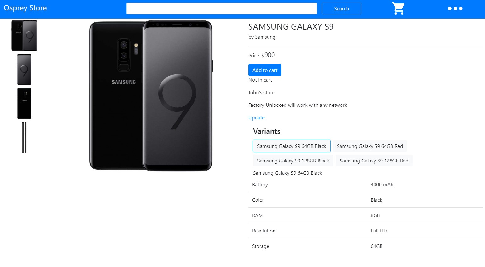
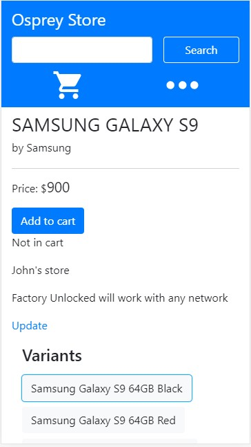
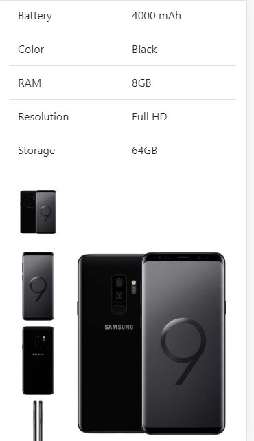

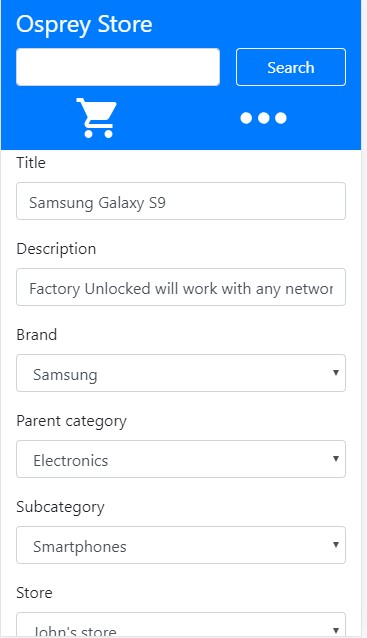
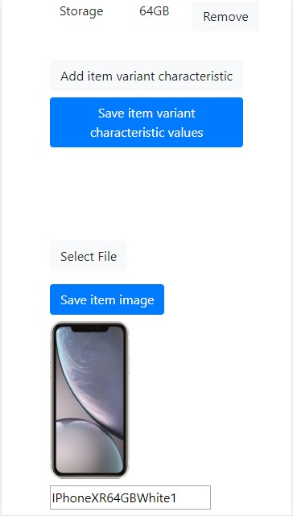