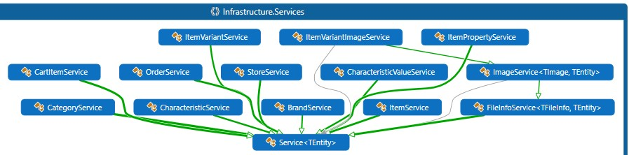

# Osprey Store

Osprey Store is web store platform providing marketplace for the sellers and the customers.  It was created with a purpose to became familiar and implement software with some fancy frameworks and patterns. Inspired by <a href="https://github.com/dotnet-architecture/eShopOnWeb">Microsoft reference solution</a>.
Please note that it was desined to look good on any screen.
I hope you can find some useful pieces of code there.

Frameworks used
---
- ASP.NET Core 2.1
- NET Standard 2.0
- Angular 7
- Bootstrap 4

Core patterns and principles
---
- SOLID principles
- Clean Architecture
- Testability
- RESTful web services
- Microservices
- Adaptive Layout
- Web Application

### SOLID

#### S—Single responsibility principle
Each component designed for one thing and has minimal knowledge of outside components and their logic. For example, each service is responsible for lifecycle of it's entity, and supposed to be changed if and only if this lifecycle changes. Although one component may depend on the other one, implementation details are hidden behind it's abstractions.

#### O—Open/closed principle
Controllers rely on services to create/read/update/delete entities. Although the internal logic may differ greatly from service to service, in the end it's just generic controller calling generic service while passing some arguments.

### Installing

Just clone and run server, no special actions required

